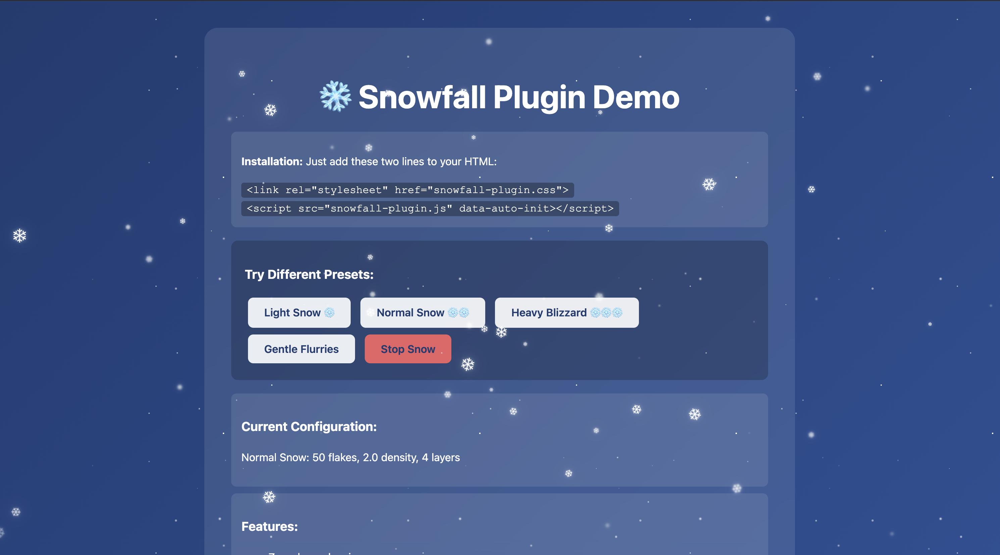

# ❄️ Snowfall Plugin

A lightweight, easy-to-use snowfall effect for any website.



**[🔴 Live Demo](https://alin-morosanu.github.io/snowfall-plugin/demo.html)** | **[📦 Download](https://github.com/alin-morosanu/snowfall-plugin/archive/refs/heads/main.zip)**

## 🚀 Quick Start

### Method 1: Auto-Initialize (Easiest)

Just add these two lines to your HTML:

```html
<link rel="stylesheet" href="snowfall-plugin.css">
<script src="snowfall-plugin.js" data-auto-init></script>
```

That's it! Snow will appear on your page.

### Method 2: Custom Configuration

```html
<link rel="stylesheet" href="snowfall-plugin.css">
<script src="snowfall-plugin.js"></script>
<script>
  SnowfallPlugin.init({
    numberOfSnowflakes: 50,        // Big snowflakes (❄)
    smallSnowflakeDensity: 2,      // Background dots density
    snowflakeMinSize: 0.5,         // Min size for big flakes (em)
    snowflakeMaxSize: 1.0,         // Max size for big flakes (em)
    numberOfLayers: 2              // Number of background layers
  });
</script>
```

### Method 3: Data Attributes

```html
<link rel="stylesheet" href="snowfall-plugin.css">
<script 
  src="snowfall-plugin.js" 
  data-auto-init
  data-snowflakes="80"
  data-density="1.5"
  data-layers="4"
></script>
```

## ⚙️ Configuration Options

| Option | Type | Default | Description |
|--------|------|---------|-------------|
| `numberOfSnowflakes` | number | 50 | Number of large snowflakes (❄) |
| `smallSnowflakeDensity` | number | 2 | Density of small background dots (0.5-3) |
| `snowflakeMinSize` | number | 0.5 | Minimum size for large flakes in em |
| `snowflakeMaxSize` | number | 1.0 | Maximum size for large flakes in em |
| `smallBitsMinSize` | number | 0.5 | Minimum size for small dots in px |
| `smallBitsMaxSize` | number | 1.5 | Maximum size for small dots in px |
| `numberOfLayers` | number | 2 | Number of background snow layers |

## 🎨 Examples

### Light Snow
```javascript
SnowfallPlugin.init({
  numberOfSnowflakes: 30,
  smallSnowflakeDensity: 0.8,
  numberOfLayers: 1
});
```

### Heavy Blizzard
```javascript
SnowfallPlugin.init({
  numberOfSnowflakes: 100,
  smallSnowflakeDensity: 3,
  numberOfLayers: 6
});
```

### Gentle Flurries
```javascript
SnowfallPlugin.init({
  numberOfSnowflakes: 20,
  smallSnowflakeDensity: 0.5,
  snowflakeMinSize: 0.3,
  snowflakeMaxSize: 0.7
});
```

## 🛠️ Methods

### Initialize
```javascript
SnowfallPlugin.init(options);
```

### Remove Snow
```javascript
SnowfallPlugin.destroy();
```

## 📦 Files Needed

- `snowfall-plugin.js` (17KB)
- `snowfall-plugin.css` (12KB)

## 🌟 Features

- ✅ Zero dependencies
- ✅ Lightweight and performant
- ✅ Multiple layers of depth
- ✅ Natural wind and drift effects
- ✅ Random melting animations
- ✅ Fully customizable
- ✅ Works with any website
- ✅ Mobile-friendly

## 📱 Browser Support

Works in all modern browsers that support CSS animations and ES5+ JavaScript.

## 📄 License

Free to use for personal and commercial projects.

## 🎁 Bonus Tips

- Use `numberOfLayers: 4-6` for a denser, more realistic snow
- Adjust `smallSnowflakeDensity` between 0.5-3 for best results
- For subtle effects, lower `numberOfSnowflakes` to 20-30
- The snow effect uses `position: fixed` and won't interfere with your page layout

---

Made with ❄️ for the holidays
